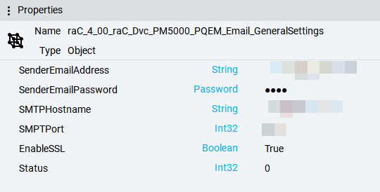

# PowerMonitorAdvanced

## Table of Contents
- [PowerMonitorAdvanced](#powermonitoradvanced)
  - [Table of Contents](#table-of-contents)
  - [Overview](#overview)
  - [Key Features](#key-features)
  - [Supported Devices](#supported-devices)
  - [Tabs and Functionality](#tabs-and-functionality)
    - [Banner](#banner)
      - [What It Does](#what-it-does)
      - [How It Helps You](#how-it-helps-you)
      - [Features](#features)
      - [Limitations](#limitations)
    - [1. Home: Real-Time Power Quality Dashboard](#1-home-real-time-power-quality-dashboard)
      - [What It Does](#what-it-does-1)
      - [Components](#components)
      - [How It Helps You](#how-it-helps-you-1)
    - [2. Energy: Live Energy and Demand Dashboard](#2-energy-live-energy-and-demand-dashboard)
      - [What It Does](#what-it-does-2)
      - [Components](#components-1)
      - [How It Helps You](#how-it-helps-you-2)
    - [3. Harmonics](#3-harmonics)
      - [What It Does](#what-it-does-3)
      - [Components](#components-2)
      - [How It Helps You](#how-it-helps-you-3)
    - [4. Wiring Diagnostics](#4-wiring-diagnostics)
      - [What It Does](#what-it-does-4)
      - [Components](#components-3)
      - [How It Helps You](#how-it-helps-you-4)
    - [5. ITI and SEMI F47 Chart](#5-iti-and-semi-f47-chart)
      - [What It Does](#what-it-does-5)
      - [Components](#components-4)
      - [How It Helps You](#how-it-helps-you-5)
      - [Limitations](#limitations-1)
    - [6. Power Quality \& Events Logs](#6-power-quality--events-logs)
      - [What It Does](#what-it-does-6)
      - [Components](#components-5)
      - [How It Helps You](#how-it-helps-you-6)
      - [Limitations](#limitations-2)
    - [7. Logs](#7-logs)
      - [What It Does](#what-it-does-7)
      - [Components](#components-6)
      - [How It Helps You](#how-it-helps-you-7)
      - [Limitations](#limitations-3)
    - [8. Configuration](#8-configuration)
      - [What It Does](#what-it-does-8)
      - [Components](#components-7)
      - [How It Helps You](#how-it-helps-you-8)
      - [Limitations](#limitations-4)
    - [9. Alarms](#9-alarms)
      - [What It Does](#what-it-does-9)
      - [Components](#components-8)
      - [How It Helps You](#how-it-helps-you-9)
      - [Limitations](#limitations-5)
  - [Setup](#setup)
    - [How to Set Up Power Monitor in FactoryTalk Optix](#how-to-set-up-power-monitor-in-factorytalk-optix)
      - [Step 1: Import the Power Monitor Library](#step-1-import-the-power-monitor-library)
      - [Step 2: Updating Project References](#step-2-updating-project-references)
      - [Step 3: Set-Up Initial Configuration Script](#step-3-set-up-initial-configuration-script)
      - [Step 4: Configuring Global E-mail Settings](#step-4-configuring-global-e-mail-settings)
      - [Step 5: Creating PowerMonitor Model Instances](#step-5-creating-powermonitor-model-instances)
      - [Step 6: Add and Configure the Graphical Symbol](#step-6-add-and-configure-the-graphical-symbol)
      - [Step 7: Create Runtime and Access the Faceplate](#step-7-create-runtime-and-access-the-faceplate)
    - [Help for Setup](#help-for-setup)
      - [Tips](#tips)
      - [Limitations](#limitations-6)
  - [Dependencies](#dependencies)

## Overview
The PowerMonitorAdvanced Faceplate for FactoryTalk® Optix is a user-friendly tool designed to monitor and manage power-related metrics in real time. It offers intuitive dashboards and logs to track power quality, energy usage, wiring issues, and system events, helping you optimize performance and maintain reliable operations.

## Key Features
- Real-time dashboards for power quality (voltage, current, power, frequency)
- Energy and demand tracking to monitor power flow and efficiency
- Detailed logs for power quality events, alarms, and energy usage
- Wiring diagnostics to identify and resolve connection issues
- Harmonic analysis to detect distortions in the power system
- ITI and SEMI F47 charts for visualizing power quality events
- Email notifications for critical power quality alerts

## Supported Devices
- 1423-M5E PowerMonitor 5000
- 1423-M6E PowerMonitor 5000
- 1423-M8E PowerMonitor 5000

## Tabs and Functionality

### Banner
The Banner, displayed at the top of every tab, provides a quick snapshot of your device’s status and any active alerts.

#### What It Does
- Shows if your device is connected ("Ready") or not ("Not Ready") along with its IP address.
- Highlights active alarms with a warning icon if issues like over-voltage occur.
- Updates continuously to keep you informed.

#### How It Helps You
- Instantly know if your device is working properly without switching tabs.
- Get immediate alerts for critical issues, so you can act quickly.
- Stay informed with a consistent overview across all tabs.

#### Features
- Displays "Ready" with the IP address (e.g., "Ready 10.141.80.86") when connected, or "Not Ready" with the reason (e.g., "Communication Failure").
- Shows "Active Alarm" with a warning icon for issues like voltage spikes; click to view a list of alarms.
- Hides alarm warnings when no issues are present for a clean interface.
- Always visible on every tab for easy monitoring.

#### Limitations
- Requires a stable device connection; shows "Not Ready" if offline.
- Updates every few seconds, so brief issues may have a slight delay.
- Summarizes alarms; detailed information is available on the Alarms tab.

### 1. Home: Real-Time Power Quality Dashboard
#### What It Does
The Home tab offers a real-time dashboard showing key power quality metrics like voltage, current, power, and frequency across all phases.

#### Components
- **Voltages**: Tracks phase-to-neutral (V1, V2, V3), neutral-to-ground, and phase-to-phase voltages, plus average values and phase rotation.
- **Currents**: Monitors current in each phase (I1, I2, I3, I4) and the average current.
- **Power**: Displays active (kW), reactive (kVAR), and apparent (kVA) power, plus power factor (True and Displacement) for each phase and total.
- **Frequency**: Shows system frequency and its average.
- **Timestamps**: Includes the latest data refresh time for accuracy.

  

#### How It Helps You
- Monitor critical power metrics in real time to ensure system stability.
- Quickly spot issues like voltage drops or phase imbalances.
- Use clear visuals to understand power performance at a glance.


### 2. Energy: Live Energy and Demand Dashboard
#### What It Does
The Energy tab shows live data on energy consumption and demand, helping you track power usage and efficiency.

#### Components
- **Energy Metrics**: Displays forward and reverse energy consumption (kWh).
- **Demand Metrics**: Tracks current demand (kW), reactive demand (kVAR), and apparent demand (kVA).
- **Dashboard**: Visualizes energy and demand data with graphs and tables.
- **Timestamp**: Shows the last data update time.

#### How It Helps You
- Understand energy usage patterns to optimize costs.
- Monitor demand to manage peak loads and avoid penalties.
- Identify inefficiencies with clear, real-time visuals.

### 3. Harmonics
#### What It Does
The Harmonics tab analyzes distortions in the power system, showing harmonic levels for voltages, currents, and power.

#### Components
- **Harmonic Metrics**: Tracks total and phase-specific power (kW, kVAR, kVA), voltage (RMS and angles), and current (RMS and angles).
- **Harmonic Ranges**: Covers DC to 31st, 32nd to 63rd, 64th to 95th, and 96th to 127th harmonics.
- **Dashboard**: Displays harmonic data with graphs for easy analysis.
- **Timestamp**: Shows the last data update time.

#### How It Helps You
- Detect harmonic distortions that could harm equipment.
- Analyze specific harmonic ranges to pinpoint issues.
- Use visuals to assess power quality impacts quickly.

### 4. Wiring Diagnostics
#### What It Does
The Wiring Diagnostics tab identifies issues in your power system’s wiring, ensuring proper connections.

#### Components
- **General Diagnostics**: Checks for missing voltage or current inputs.
- **Range-Specific Diagnostics**: Monitors three wiring ranges (L97_C89, L85_C98, L52_L95) for status, inverted inputs, and phase rotations.
- **Phase Metrics**: Tracks voltage and current angles and magnitudes for each phase.
- **Dashboard**: Visualizes wiring status with clear indicators.
- **Timestamp**: Shows the last data update time.

#### How It Helps You
- Quickly identify wiring issues like inverted connections or phase errors.
- Ensure reliable system operation with clear diagnostic feedback.
- Use visuals to simplify troubleshooting.

### 5. ITI and SEMI F47 Chart
#### What It Does
The ITI and SEMI F47 Chart tab visualizes power quality events (e.g., voltage sags) on a chart, showing their duration and deviation from normal voltage.

#### Components
- **Event Chart**: Plots events as cycles (duration) vs. percentage deviation from 480V nominal voltage.
- **Time Range Filters**: View events from the last 24 hours, week, month, 6 months, year, or a custom range.
- **Status Label**: Shows feedback like “Fetching data” or “No events found.”
- **Dashboard**: Displays the ITI/SEMI F47 chart with event data.

#### How It Helps You
- Visualize power quality events to assess their severity.
- Filter events by time to focus on specific periods.
- Identify trends in power disruptions for better planning.

#### Limitations
- Not supported for devices with catalog number "1426-M5".
- Shows an empty chart if no events are found for the selected time range.
- Uses a fixed 480V nominal voltage, which may need adjustment.

### 6. Power Quality & Events Logs
#### What It Does
The Power Quality & Events Logs tab tracks power quality issues like voltage sags, swells, or transients, with detailed event and waveform data.

#### Components
- **Event Table**: Lists events with details like type (e.g., Voltage Sag), timestamp, duration, and severity.
- **Waveform Graphs**: Shows voltage and current changes over time for each event.
- **Time Range Filters**: View events from the last 24 hours, week, month, 6 months, year, or a custom range.
- **Email Notifications**: Alerts you to new events via email.
- **Status Label**: Provides updates like “Found 5 new events.”

#### How It Helps You
- Stay informed about power quality issues with real-time alerts.
- Analyze events and waveforms to understand their causes.
- Filter logs to focus on specific time periods or issues.

#### Limitations
- Not supported for devices with catalog number "1426-M5".
- Requires a stable connection; shows errors if the device is offline.
- Waveform data is only available for events with associated timestamps.

### 7. Logs
#### What It Does
The Logs tab organizes historical data on power metrics, system events, and alarms for easy review and analysis.

#### Components
- **Data Log**: Shows trends in voltage, current, power, and frequency over time.
- **Events Logs**: Records system events like power-ups or configuration changes.
- **Alarm Logs**: Lists alarms for issues like voltage loss or overcurrent.
- **Min-Max Logs**: Tracks highest and lowest values for key metrics.
- **Setpoint Logs**: Monitors threshold crossings for set metrics.
- **TOU Logs**: Records energy usage by time-of-use periods (e.g., peak vs. off-peak).
- **Energy Logs**: Tracks total energy consumption (kWh) over time.
- **Refresh Button**: Updates logs with the latest data.

#### How It Helps You
- Review historical data to spot trends or recurring issues.
- Use graphs and tables to analyze system performance.
- Track energy usage for cost management and efficiency.

#### Limitations
- Requires a device connection; shows errors if offline.
- May display “No files found” if no data has been logged.

### 8. Configuration
#### What It Does
The Configuration tab lets you set up and manage system settings for users, devices, and notifications.

#### Components
- **User Settings**: Add or manage user accounts and permissions.
- **Device Settings**: Configure device details like IP address, name, and location.
- **Email Logs**: View a history of sent emails (e.g., event notifications) with status details.
- **Test Email Option**: Verify email notification functionality.
- **Refresh Button**: Updates email logs with the latest activity.

#### How It Helps You
- Control access to ensure only authorized users view data.
- Easily configure device settings for reliable monitoring.
- Confirm email alerts are working to stay informed.

#### Limitations
- Stores only the last 50 email logs.
- Requires correct SMTP settings for email notifications.
- Shows errors if the device IP is incorrect or offline.

### 9. Alarms
#### What It Does
The Alarms tab displays active and past alerts for critical issues like voltage drops or device errors.

#### Components
- **Alarm Table**: Lists alarms with type (e.g., “Metering Status”), description (e.g., “Volts Loss V1”), and timestamp.
- **Refresh Button**: Updates the list with the latest alarms.
- **Status Label**: Shows feedback like “Fetching alarms” or “No alarms found.”

#### How It Helps You
- Quickly spot and address critical system issues.
- Review past alarms to identify patterns or recurring problems.
- Use clear visuals for easy issue tracking.

#### Limitations
- Requires a device connection; shows errors if offline.
- Displays “No alarms found” if no alarms are logged.

## Setup
The Setup section guides you through integrating the PowerMonitorAdvanced Faceplate with FactoryTalk Optix to monitor power metrics efficiently.

### How to Set Up Power Monitor in FactoryTalk Optix

#### Step 1: Import the Power Monitor Library
- **Action**: Open FactoryTalk Optix Studio (version 1.4 or higher) and create or open a project.
- **Details**: In the Libraries window, find the PowerMonitor library under RockwellAutomationLibraries. Drag the UI folder (raC_4_00_raC_Dvc_PM5000_PQEM_UI) and Model folder (raC_4_00_raC_Dvc_PM5000_PQEM_Model) into your project’s UI and Model directories.
- **Result**: Imports the faceplate and graphical symbols into your project.

#### Step 2: Updating Project References
The PowerMonitorAdvanced library uses Newtonsoft.Json for JSON handling. After importing the library objects into FactoryTalk Optix, you may encounter NetLogic errors indicating that the solution failed to build. To resolve these errors, update the project references by adding the Newtonsoft.Json dependency as follows:

- **Action**: Navigate to your project file folder. In FactoryTalk Optix Studio, click the folder button in the toolbar, then click it again to open the path in Windows Explorer.
  
- **Details**: Open the `NetSolution` folder and locate the `.csproj` file, which matches your project’s name. Open this file in a text editor like Notepad. Add the following code just before the final line (`</Project>`):
  ```xml
  <ItemGroup>
    <Reference Include="Newtonsoft.Json">
      <HintPath>Newtonsoft.Json.dll</HintPath>
    </Reference>
  </ItemGroup>

#### Step 3: Set-Up Initial Configuration Script
A provided script must be run to configure required links between models and databases.
- Navigate to the Model node, then locate and expand raC_4_00_raC_Dvc_PM5000_PQEM_Model. Right-click on raC_4_00_raC_Dvc_PM5000_PQEM_Setup and select "Execute SetupInitialConfiguration" to automatically configure all required objects.
  

#### Step 4: Configuring Global E-mail Settings
You can optionally configure e-mail notifications for Power Quality events.
This requires an SMTP e-mail server. This is an optional feature. User
management and configuration is done in the runtime application and is
saved using retentivity.
- Find and select Model > raC_4_00_raC_Dvc_PM5000_PQEM_Model >
raC_4_00_raC_Dvc_PM5000_PQEM_Email_GeneralSettings


- In the Properties window, assign the settings based on your SMTP email
server and send address information. You may need to work with
your company’s IT team for these settings.


#### Step 5: Creating PowerMonitor Model Instances
- Before using the HMI graphics and faceplates, an instance of the
raC_Dvc_PM5000_PQEM (type) needs to be created for each PowerMonitor
device that you want to connect.
- Right-click on the Model folder of your project and select New >
raC_4_00_raC_Dvc_PM5000_PQEM_Model > raC_4_00_raC_Dvc_PM5000_PQEM


- Rename the instance model to something representative of your device (e.g. the area/building that it is monitoring).

  


- **Details**: In the Properties panel, set:
  - Val_IPAddress to your device’s IP (e.g., 0.0.0.0).
  - Cfg_PQEvent_Duration to 00:00:00.500 for event updates.
  - Cfg_LiveDataUp to 5000 milliseconds for live data updates.
  - Set_EnablePQ and Set_EnableLiv to True.
  - Username and Password to admin.
  - Cfg_DeviceEm to False to disable email notifications.
- 
- **Result**: Configures the model to communicate with your device.

#### Step 6: Add and Configure the Graphical Symbol
- **Action**: Go to your target screen (e.g., Screen1) under the Screens folder.
- **Details**: From the UI folder, select a graphical symbol (vertical: raC_4_00_raC_Dvc_PM5000_PQEM_NavGraphical or horizontal: raC_4_00_raC_Dvc_PM5000_PQEM_NavGraphical_Horizontal) and drag it onto the screen. In the Properties panel, set:
  - Ref_Tag to the raC_4_00_raC_Dvc_PM5000_PQEM model object.
  - Cfg_Label to PM5000_PQEM for the display label.
- **Result**: Links the symbol to the model for faceplate display.

#### Step 7: Create Runtime and Access the Faceplate
- **Action**: Save the project and create a runtime to test.
- **Details**: Use the emulator (“Local”) or download to an Optix panel. Set the target device’s IP, run the project, and click the graphical symbol to open the faceplate.
- **Result**: Access the faceplate to monitor power metrics.

### Help for Setup
This process integrates the PowerMonitorAdvanced Faceplate into FactoryTalk Optix, enabling real-time power monitoring. The library provides pre-built components, the model object ensures device communication, and the graphical symbol displays the faceplate.

#### Tips
- Use FactoryTalk Optix Studio version 1.5 or higher.
- Download the PowerMonitor library from the [Rockwell Automation Product Compatibility and Download Center](https://compatibility.rockwellautomation.com/).
- Verify the device IP in Val_IPAddress.
- Ensure Set_EnablePQ and Set_EnableLiv are True.
- Choose a vertical or horizontal symbol based on your layout.

#### Limitations
- Requires FactoryTalk Optix Studio version 1.4 or higher.
- Email notifications are disabled by default; enable via Configuration tab.
- Device must be online and accessible at the specified IP.

## Dependencies
- Newtonsoft.JSON (`NewtonsoftJSON.dll`)
